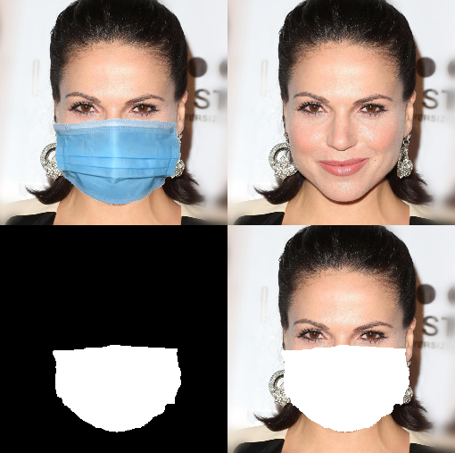

# medical-mask-overlay

This project presents functionality for applying medical masks to face images.

To setup the environment - take a look at the setup.sh.

To create CSV files for masks use https://www.makesense.ai/

The project uses CelebA-Mask-HQ (https://github.com/switchablenorms/CelebAMask-HQ) dataset as a basis

Example of possible images that can be generated:

